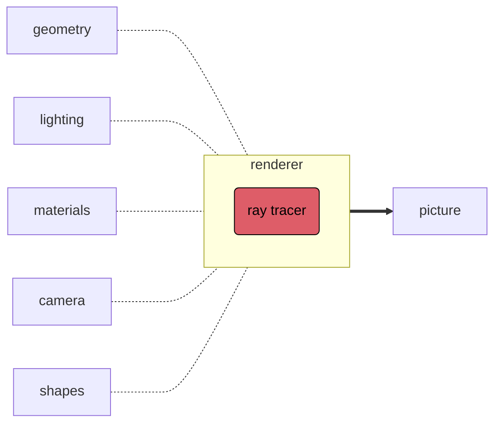
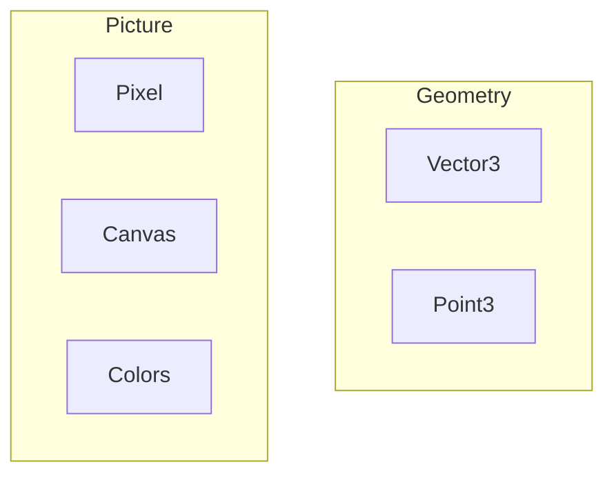

This post is **Part 1** in a series to share my journey in developing [Ruxel] a Ray Tracer and 3D Renderer written in [Rust] from scratch.

Please see the [Series Prelude] for more information regarding my [Goals] for `v.0.1.0` of this project.

Ideally, by the end of this series `Ruxel` will be able to render an image like the one in the [header], or better…

>**Note:** Explaining 3D math in depth isn't the aim of these posts. To learn more about the underlying mathematics and theory please check the books I reference in the [Series Prelude].

 

## High-Level Architecture 

The long-term objective is that `Ruxel` will become a big project, and surely it will go through several refactoring phases; however, it's critical to leverage Rust's modules' system from the beginning to keep the project well organized and easier to maintain as it grows larger.  

The following diagram presents a high-level view of the architecture of the application:



<!-- style ge fill:#de5d68,color:#000,stroke:#000; -->
<!-- style pi fill:#57a5e5,color:#000,stroke:#000; -->
<!-- style li fill:#eeb927,color:#000,stroke:#000; -->
<!-- style sh fill:#bb70d2,color:#000,stroke:#000;  -->
<!-- style ma fill:#bb70d2,color:#000,stroke:#000; -->
<br />

In this **Part 1** the focus is only to create the following:

- Initial project structure:
  - Cargo.toml
  - Modules tree
  - Unit testing
- Create the following:
  - Geometry module:
    - Vectors
      - Struct
      - Traits
      - Implementations
    - Points
      - Struct
      - Traits
      - Implementations
  - Picture module:
    - Canvas
      - Struct
      - Traits
      - Implementations
    - Pixel
      - Struct
      - Traits
      - Implementations
    - Colors
      - Struct
      - Traits
      - Implementations
    - Image
      - File

The following diagram is a 'zoom-in' from the general architecture displayed above focused on the `Geometry` and `Picture`:



Implementing these modules first will allow the testing of the basic geometric primitives and present a first image in a straightforward format.

To begin, open the terminal -in my case it's the [Alacritty] + [Tmux] + [Fish] + [Neovim] combo- and start a new Cargo project followed by several `mkdir` and `touch` commands to get the proper directory structure…

```terminal
cargo new ruxel
mkdir geometry
mkdir picture

-- other commands
```

> If you use Neovim, you can execute shell commands in Neovim's command line by prepending a `!` before the shell commands `:!mkdir geometry` or `:!touch vector.rs`   
{: .prompt-tip }

The initial project structure is the following:
```terminal
Rust/ruxel on  main [✘] > v0.0.0 | v1.63.0
 λ tree -L 4
.
├── Cargo.lock
├── Cargo.toml
├── images
├── LICENSE-APACHE
├── LICENSE-MIT
├── README.md
└── src
    ├── geometry
    │   ├── vector
    │   │   └── tests.rs
    │   └── vector.rs
    ├── geometry.rs
    ├── main.rs
    ├── picture
    │   ├── canvas
    │   │   └── tests.rs
    │   ├── canvas.rs
    │   ├── colors
    │   │   └── tests.rs
    │   └── colors.rs
    └── picture.rs

8 directories, 16 files
```

This initial scaffolding TODO: 


## Geometry Basics 


## Vectors 


## Points


## Colors


## Canvas


## First Image 
***
**_Links, references and disclaimers:_**   

Header Photo by <a href="https://unsplash.com/@lilrohit?utm_source=unsplash&utm_medium=referral&utm_content=creditCopyText">Rohit Choudhari</a> on <a href="https://unsplash.com/s/photos/3d-render?utm_source=unsplash&utm_medium=referral&utm_content=creditCopyText">Unsplash</a>
   

[ruxel]:https://github.com/rsdlt/ruxel
[Rust]:[https://www.rust-lang.org]
[Series Prelude]:[https://rsdlt.github.io/posts/ruxel-ray-tracer-project-first-update-rust-programming-development/]
[Goals]:https://rsdlt.github.io/posts/ruxel-ray-tracer-project-first-update-rust-programming-development/#goals-for-ruxel-version-010
[header]:href="https://unsplash.com/@lilrohit?utm_source=unsplash&utm_medium=referral&utm_content=creditCopyText"
[Alacritty]:https://alacritty.org/
[Tmux]:https://github.com/tmux/tmux
[Neovim]:https://neovim.io/
[Fish]:https://fishshell.com/
