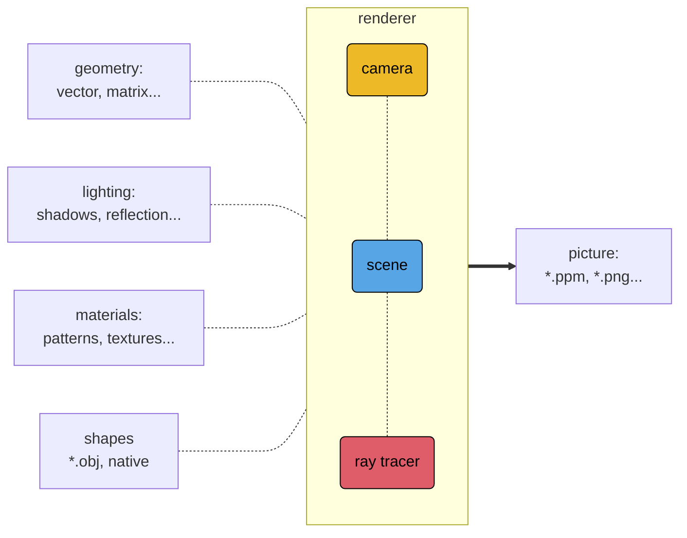
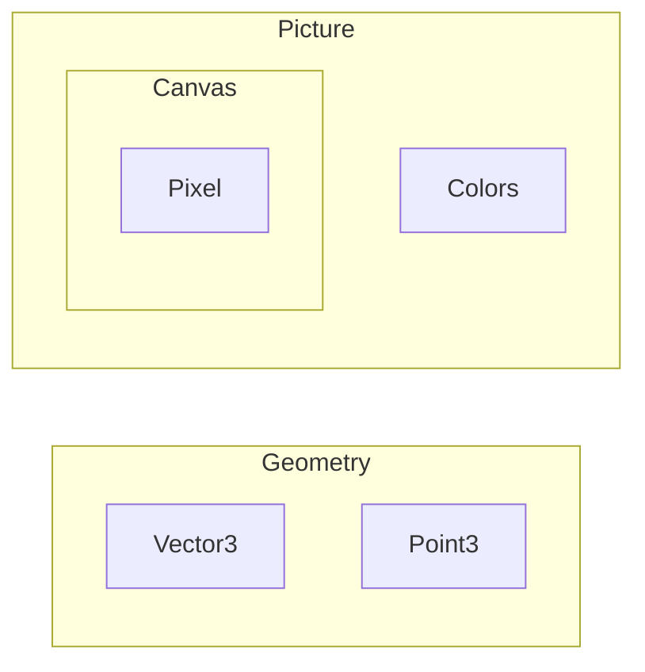

This post is **Part 1** in a series to share my journey in developing [Ruxel] a Ray Tracer and 3D Renderer written in [Rust] from scratch.

Please see the [Series Prelude] for more information regarding my [Goals] for `v.0.1.0` of this project.

Ideally, by the end of this series `Ruxel` will be able to render an image like the one in the [header], or better…

>**Note:** Explaining 3D math in depth isn't the aim of these posts. To learn more about the underlying mathematics and theory please check the books I reference in the [Series Prelude].

 

## High-Level Architecture 

The long-term objective is that `Ruxel` will become a big project, and surely it will go through several refactoring phases; however, it's critical to leverage Rust's modules' system from the beginning to keep the project well organized and easier to maintain as it grows larger…

The following diagram presents a high-level view of the architecture of the application, at least for `v.0.1.0`:



<!-- style ge fill:#de5d68,color:#000,stroke:#000; -->
<!-- style pi fill:#57a5e5,color:#000,stroke:#000; -->
<!-- style li fill:#eeb927,color:#000,stroke:#000; -->
<!-- style sh fill:#bb70d2,color:#000,stroke:#000;  -->
<!-- style ma fill:#bb70d2,color:#000,stroke:#000; -->
<br />

In this **Part 1** the focus is only to create the following:

- Initial project structure:
  - Cargo.toml
  - Modules tree
  - Unit testing
- Create the following:
  - Geometry module:
    - Vectors
      - Struct
      - Traits
      - Implementations
    - Points
      - Struct
      - Traits
      - Implementations
  - Picture module:
    - Canvas
      - Struct
      - Traits
      - Implementations
    - Pixel
      - Struct
      - Traits
      - Implementations
    - Colors
      - Struct
      - Traits
      - Implementations
    - Image
      - File

The following diagram is a 'zoom-in' from the general architecture displayed above focused on the `Geometry` and `Picture`:



Implementing these modules first will allow the testing of the basic geometric primitives and present a first image in a straightforward format.

## Project scaffolding

To begin, open the terminal -in my case it's the [Alacritty] + [Tmux] + [Fish] + [Neovim] combo- and start a new Cargo project followed by several `mkdir` and `touch` commands to get the proper directory structure…

```terminal
cargo new ruxel
mkdir geometry
mkdir picture

-- other commands
```

> If you use Neovim, you can execute shell commands in Neovim's command line by prepending a `!` before the shell commands, for example: `:!mkdir geometry` or `:!touch vector.rs`.
{: .prompt-tip }

The initial project structure is the following:

```terminal
Rust/ruxel on  main [✘] > v0.0.0 | v1.63.0
 λ tree -L 4
.
├── Cargo.lock
├── Cargo.toml
├── images
├── LICENSE-APACHE
├── LICENSE-MIT
├── README.md
└── src
    ├── geometry
    │   ├── vector
    │   │   └── tests.rs
    │   └── vector.rs
    ├── geometry.rs
    ├── main.rs
    ├── picture
    │   ├── canvas
    │   │   └── tests.rs
    │   ├── canvas.rs
    │   ├── colors
    │   │   └── tests.rs
    │   └── colors.rs
    └── picture.rs

8 directories, 16 files
```

This initial scaffolding allows to continue adding modules, and their respective unit tests, in an structured way.

For example, adding a `Matrix` module would imply creating a new `matrix` directory, its rust source file and respective tests:

- `/src/geometry/matrix/`
- `/src/geometry/matrix.rs`
- `/src/geometry/matrix/tests.rs`

This would yield the following tree:

```terminal
Rust/ruxel on  main [✘] > v0.0.0 | v1.63.0
 λ tree -L 4
.
├── Cargo.lock
├── Cargo.toml
├── images
├── LICENSE-APACHE
├── LICENSE-MIT
├── README.md
└── src
    ├── geometry
**  │   ├── matrix 
**  │   │   └── tests.rs
**  │   ├── matrix.rs
    │   ├── vector
    │   │   └── tests.rs
    │   └── vector.rs
    ├── geometry.rs
    ├── main.rs
    ├── picture
    │   ├── canvas
    │   │   └── tests.rs
    │   ├── canvas.rs
    │   ├── colors
    │   │   └── tests.rs
    │   └── colors.rs
    └── picture.rs

8 directories, 16 files
```

Rust offers other alternatives to structure projects, like using `mod.rs`; however, I find the option of using a file and directory name to be the clearer.

Important `diagnostic attributes` to set up from the beginning:

`/src/main.rs`

```rust
#![warn(missing_docs, missing_debug_implementations)]
```

This will provide linter warnings for missing `doc comments` used by Rust to generate automatic documentation, and for detecting types missing the `Debug` trait that provides convenient ways to display type values during development.

And finally, lets make sure all of our files are part of Rust's `module tree`:

`/src/main.r`

```rust
/**
The geometry module implements the functionality for Points, Vectors, Matrices, and their transformations
*/
pub mod geometry;

/**
The picture module implements the functionality for Canvas and Colors in order to create an image file.
*/
pub mod picture;
```

`/src/geometry.rs`

```rust
/// Provides data structures, methods and traits for Matrix4 computations.
pub mod matrix;
/// Data structures and methods for Vector3 and Point3 computations.
pub mod vector;
```

`/src/picture.rs`

```rust
/// Provides the data structure and implementation of the Color type
pub mod colors;

/// Provides the data structure and implementation of the Canvas type
pub mod canvas;
```

`/src/geometry/vector.rs`

```rust
// Unit tests for Vector3 and Point3
#[cfg(test)]
mod tests;
```

`/src/picture/canvas.rs`

```rust
// Canvas Unit Tests
#[cfg(test)]
mod tests;
```

`/src/picture/colors.rs`

```rust
// Colors Unit Tests
#[cfg(test)]
mod tests;
```

If everything is properly set up `rust-analyzer` shouldn't emit a warning regarding that a file isn't part of the module tree.

It's now possible to write some types with their `associated functions` and bring them into the `main.rs` scope with full `rust-analyzer` completion assistance:

`/src/main.rs`

```rust
fn main() {
    let v = Vector3::one();
    let p = Point3::one();

    println!("Vector: {:?} \n Point: {:?}", v, p);

    let c = ColorRgb::red();
    println!("Color: {}", c);
}
```

Now that the initial scaffolding is done, lets start coding.

## Vectors and Points

The module `vector` contains the types `Vector3` and `Point3` which are mathematically defined as:

$$
\begin{align}
  \vec{v} =
  \begin{bmatrix}
    x & y & z
  \end{bmatrix}
\end{align}
$$

$$
\begin{align}
  \vec{p} =
  \begin{bmatrix}
    x & y & z & w
  \end{bmatrix}
\end{align}
$$

### Type definitions

The mathematic definition can be translated into Rust code as follows:
`/src/geometry/vector.rs`

```rust
/// Type representing a geometric 3D Vector with x, y, z components.
#[derive(Debug, Clone, Copy)]
pub struct Vector3<T> {
    /// Component on x axis
    pub x: T,
    /// Component on y axis
    pub y: T,
    /// Component on z axis
    pub z: T,
}

/// Type representing a geometric 3D Point with x, y, z components.  
#[derive(Debug, Clone, Copy)]
pub struct Point3<T> {
    /// Component on x axis
    pub x: T,
    /// Component on y axis
    pub y: T,
    /// Component on z axis
    pub z: T,
    /// Component representing the 'weight' 
    pub w: T,
}
```

Both types:

- Are `named-field` structures to have access to their components by name (for example: `vector.x`, `point.z`).
- Have `generic type parameters` in their components so to have the flexibility to implement them as `f64` or `i64`, etc.
- Implement the `common traits` of `Debug`, `Copy` and `Clone`.
- Are, for the moment, public via `pub`.

The most consequential decision here is that both types implement the `Copy` and `Clone` common traits.

And the main reason is that all their components are expected to be common numeric types like `i64`, `f64`, etc., that don't own `heap` resources.

### Traits and implementation

Out of the countless ways to implement the desired functionality for these types, the preferred for this project is to:

- For `v.0.1.0` focus on implementing `Vector` and `Point` for common numeric types `f64` and for a `3D coordinate system`. So no `Vector2<f64>` or `Point3<i64>`.
- Create a public `Enum` named `Axis` that specifies the axis of a 2D,3D or 4D coordinate system. 
- Create a public trait named `CoordInit` that specifies the methods for initializing the coordinate system for any type that implements it:
  - This provides extensibility for other types of vectors and points, like `Vector2` or `Point2`, or basically any type that requires a coordinate initialization: up, down, back, forward, etc.
- Implement `CoordInit` trait for `Vector3` and `Point3`
- Create a public trait named `VecOps` that defines common capabilities exclusive for Vectors, like `magnitude`, `cross product`, `dot product`, etc.
- Implement the associated function `new(...)` on each type.
- Implement `operator overloading` capabilities to conveniently write common binary operations over `Vector3` and `Point3` (to learn more about this topic you can check this post [Basic Operator Overloading with Traits]):
  - Add, AddAssign
  - Sub, SubAssign
  - Mul and Div
  - Neg
- Implement the following `common traits`:
  - `Display`, `Debug`, `Default`, `Eq` and `PartialEq`
- Define an `EPSILON` constant for floating-point comparisons. Rust provides `f64::EPSILON`, however a decimal precision of only 5 digits is enough for this application.

#### Axis enumerator

A critical, yet opinionated decision, is how to best handle the initialization of new coordinate-related types, like vectors and points, using a trait with type-associated functions with different signatures.
In essence, how to handle this case:

```rust
trait Init{
        fn new(...);
    }

impl Init for Vector2<T>{
        fn new(x: T, y: T) -> Self{...}
    }
impl Init for Vector3<T>{
        fn new(x: T, y: T, z: T) -> Self{...}
    }
impl Init for Point4<T>{
        fn new(x: T, y: T, z: T, w: T) -> Self{...}
    }

```

There are various alternatives like using associated functions with the `turbofish` syntax, however for this project I favor utilizing an `enumerator` to encapsulate the `method parameters`:

```rust
/**
Enumerator that encapsulates the different coordinate systems used to initialize a Vector or
Point
*/
#[derive(Debug)]
pub enum Axis<U> {
    /// Coordinate system with X and Y axis.
    XY(U, U),
    /// Coordinate system with X, Y and Z axis.
    XYZ(U, U, U),
    /// Coordinate system with X, Y, Z and W axis.
    XYZW(U, U, U, U),
}
```

And then bring it into scope using a simplified alias:

```rust
use geometry::vector::{
    Axis,
    Axis::{XY as xy, XYZ as xyz, XYZW as xyzw},
};

```

With the end result in being able to initialize a new coordinate-related type in a consistent, clear and condensed manner using the `new(...)` method name:

```rust
    let vec3 = Vector3::new(xyz(1.0, 2.0, 3.0));
    let point3 = Point3::new(xyzw(1.0, 2.0, 3.0, 4.0));
```

It provides the added benefit of `extensibility` to new types while maintaining a consistent initialization syntax.

So for example, if in the future the `Vector2`, `Vector4`, `Point2` or any other coordinate-related type requires a `new method` we would use the same syntax:

```rust
    let vec2 = Vector2::new(xy(1.0, 2.0));
    let vec3 = Vector3::new(xyz(1.0, 2.0, 3.0));
    let vec4 = Vector4::new(xyzw(1.0, 2.0, 3.0, 4.0));
    let point2 = Point2::new(xy(1.0, 2.0));
    let point3 = Point3::new(xyz(1.0, 2.0, 3.0));
    let point4 = Point4::new(xyzw(1.0, 2.0, 3.0, 4.0));
```


In the following section, where the `CoordInit` trait is defined, it's shown how to utilize the `Axis enumerator` in the trait function.


#### CoordInit trait 

The main goal of the `CoordInit` trait is to define the functionality to initialize any coordinate-related type, in its most `common` ways, but also by in a `user-defined` way.

In the case of coordinate-related types the most common initializations are: up, down, left, right, forward, back, one and zero.

Also, having a `self.equal()` method to compare one type against another can be handy.

In Rust, this trait can be defined as follows:

```rust
/// Trait allows Types with coordinates (x, y, etc.) to be efficiently initialized with common shorthand.
pub trait CoordInit<T, U> {
    /// Return a type with shorthand, for example [0, 0, -1].
    fn back() -> T;
    /// Return a type with shorthand, for example  [0, -1, 0].
    fn down() -> T;
    /// Return true if a type is identical to another, else return false.
    fn equal(self, rhs: Self) -> bool;
    /// Return a type with shorthand, for example  [0, 0, 1].
    fn forward() -> T;
    /// Return a type with shorthand, for example  [-1, 0, 0].
    fn left() -> T;
    /// Return a type with user-defined Axis components.
    fn new(axis: Axis<U>) -> T;
    /// Return a type with shorthand, for example  [1, 1, 1].
    fn one() -> T;
    /// Return a type with shorthand [1, 0, 0].
    fn right() -> T;
    /// Return a type with shorthand [0, 1, 0].
    fn up() -> T;
    /// Return a type with shorthand [0, 0, 0].
    fn zero() -> T;
}
```

The next step is to implement each of these functions for the specific types that are needed. 

As defined above, for `v.0.1.0` the focus is only to support types in 3 dimensions and floating point (`f64`). However, the framework to make it extensible to other dimensions and primitive data types is already established.

For the full implementation details you can visit Ruxel's [Github repository]. Here, I will explain just a couple:
- `fn new(axis: Axis<U>) -> T`
- `fn zero()`


#### Operator overloading

#### Common traits


#### Epsilon constant


### Unit tests

## Colors


### Traits and implementation

### Unit tests

## Canvas


### Traits and implementation

### Unit tests

## First Image 

Finally, all can be incorporated into a unified test that produces the first image:

Not exactly as the header photo yet, but this is just the first step…


***
**_Links, references and disclaimers:_**   

Header Photo by <a href="https://unsplash.com/@lilrohit?utm_source=unsplash&utm_medium=referral&utm_content=creditCopyText">Rohit Choudhari</a> on <a href="https://unsplash.com/s/photos/3d-render?utm_source=unsplash&utm_medium=referral&utm_content=creditCopyText">Unsplash</a>
   

[ruxel]:https://github.com/rsdlt/ruxel
[Rust]:[https://www.rust-lang.org]
[Series Prelude]:[https://rsdlt.github.io/posts/ruxel-ray-tracer-project-first-update-rust-programming-development/]
[Goals]:https://rsdlt.github.io/posts/ruxel-ray-tracer-project-first-update-rust-programming-development/#goals-for-ruxel-version-010
[header]:href="https://unsplash.com/@lilrohit?utm_source=unsplash&utm_medium=referral&utm_content=creditCopyText"
[Alacritty]:https://alacritty.org/
[Tmux]:https://github.com/tmux/tmux
[Neovim]:https://neovim.io/
[Fish]:https://fishshell.com/
[Basic Operator Overloading with Traits]:/posts/welcome-blog-rust-technology-development-programming-language/
